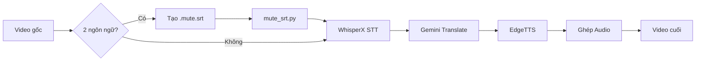

# CharenjiZukan - Video Translation & Dubbing Tools

Bộ công cụ tự động hóa quy trình lồng tiếng video sử dụng AI (WhisperX, Gemini, EdgeTTS) trên Google Colab.

## Tính năng

- **Speech-to-Text**: WhisperX chuyển audio thành subtitle (.srt)
- **Dịch**: Gemini API dịch subtitle sang ngôn ngữ đích
- **Text-to-Speech**: EdgeTTS tạo audio từ subtitle đã dịch
- **Mute Audio**: Loại bỏ các đoạn audio không mong muốn trước khi xử lý WhisperX

## Cài đặt

```bash
# Clone repository
git clone <repo-url>
cd CharenjiZukan

# Cài đặt dependencies với uv
pip install uv
uv sync
```

## Cấu trúc project

```
CharenjiZukan/
├── cli/                    # CLI modules
│   ├── mute_srt.py         # Mute audio từ file .mute.srt
│   ├── translate_srt.py    # Dịch .srt bằng Gemini API
│   └── tts_srt.py          # Chuyển .srt thành audio
│
├── utils/                  # Shared utilities
│   ├── logger.py           # Logging module
│   └── srt_parser.py       # SRT parser
│
├── prompts/                # Prompt templates
│   └── gemini.txt          # Prompt cho Gemini translation
│
├── docs/                   # Documentation
│   ├── workflow.md         # Workflow tổng quan
│   ├── colab-guide.md      # Hướng dẫn Google Colab
│   └── logging-guide.md    # Hướng dẫn logging
│
├── tests/                  # Unit tests
├── logs/                   # Project memory
│   └── JOURNAL.md          # Change log
│
├── translator.py           # Core translation logic
├── tts_edgetts.py          # EdgeTTS engine
└── pyproject.toml          # Project config
```

## Sử dụng

### 1. Mute Audio (cho video có 2 ngôn ngữ)

Khi audio có 2 ngôn ngữ (bình luận + video gốc trích dẫn), cần tạo file `.mute.srt` để đánh dấu các đoạn cần mute:

```bash
# Tạo file video.mute.srt thủ công
# Format:
# 1
# 00:01:24,233 --> 00:01:27,566
# [MUTE] Đoạn cần mute

# Chạy mute_srt.py
uv run cli/mute_srt.py --input video.mp4 --mute video.mute.srt

# Output: video_muted.wav (WAV 16kHz mono)
```

### 2. Dịch Subtitle

```bash
uv run cli/translate_srt.py --input video.srt --keys "AIza..."
```

### 3. Text-to-Speech

```bash
uv run cli/tts_srt.py --input video_vi.srt --voice ja-JP-KeitaNeural
```

## Workflow



## Dependencies

- Python >= 3.10
- pydub - Xử lý audio
- edge-tts - Text-to-Speech
- google-genai - Gemini API
- pyrubberband - Time-stretch audio

## Tài liệu

- [Workflow tổng quan](docs/workflow.md)
- [Hướng dẫn Google Colab](docs/colab-guide.md)
- [Hướng dẫn logging](docs/logging-guide.md)

## License

MIT
