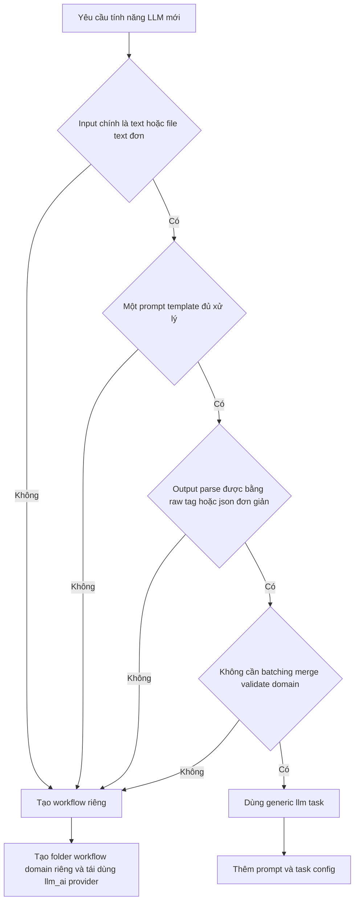

# Hướng dẫn cho AI Agent: chọn generic task hay workflow riêng cho llm_ai

## 1. Mục tiêu

Tài liệu này giúp các AI Agent quyết định nhất quán khi có yêu cầu tạo chức năng LLM mới trong dự án:

- Khi nào chỉ cần thêm prompt + task config và chạy qua generic LLM task.
- Khi nào cần tạo workflow hoặc folder riêng cho domain mới.
- Những file cần thêm hoặc cập nhật theo từng hướng.
- Những anti-pattern cần tránh để không làm `llm_ai` phình to thành tập hợp các flow rời rạc.

Nguyên tắc mặc định: **ưu tiên generic trước, chỉ tách workflow riêng khi có logic domain thật sự khác biệt**.

---

## 2. Kiến trúc liên quan hiện tại

| Tầng                     | Vai trò                                       | Vị trí chính                        |
| ------------------------ | --------------------------------------------- | ----------------------------------- |
| Provider abstraction     | Interface gọi LLM dùng chung                  | `llm_ai/base.py`                    |
| Provider factory         | Load config và khởi tạo provider              | `llm_ai/factory.py`                 |
| Provider implementations | OpenAI-compatible, Gemini, Vertex AI          | `llm_ai/providers/`                 |
| Generic text task        | Flow text-in/text-out bằng prompt template    | `llm_ai/tasks/generic_text_task.py` |
| Prompt rendering         | Thay placeholder trong prompt                 | `llm_ai/tasks/prompt_template.py`   |
| Response parsing         | Parse raw/tag/json response đơn giản          | `llm_ai/tasks/response_parser.py`   |
| Generic CLI              | CLI cho các task generic                      | `cli/llm_task.py`                   |
| Provider config          | Tham số provider/model/API endpoint           | `config/llm/`                       |
| Task config              | Prompt, placeholder, parser, output extension | `config/llm_tasks/`                 |
| Generic prompts          | Prompt cho task generic                       | `prompts/llm_tasks/`                |
| Dedicated workflow mẫu   | Dịch SRT có batching, parse, merge, validate  | `translation/`                      |

`llm_ai` chỉ nên chứa hạ tầng LLM dùng chung và helper generic. Logic domain-specific nên nằm ngoài `llm_ai`, ví dụ `translation/`.

---

## 3. Decision flow nhanh



Nếu còn phân vân, hãy chọn generic task trước. Chỉ tách workflow riêng sau khi có yêu cầu kỹ thuật rõ ràng mà generic runner không nên gánh.

---

## 4. Khi nào dùng generic LLM task

Dùng generic task khi yêu cầu có dạng **một input text + một prompt + một output text/markdown/json đơn giản**.

### 4.1 Điều kiện phù hợp

Chọn generic nếu hầu hết các điều kiện sau đều đúng:

1. Input chính là text, markdown, transcript, brief, article hoặc một file text đơn.
2. Prompt có thể biểu diễn bằng một template duy nhất.
3. Input chỉ cần thay vào một hoặc vài placeholder rõ ràng, ví dụ `[Video Content]`, `[Content]`, `[Content Brief]`.
4. Output có thể ghi thẳng ra file sau khi parse đơn giản:
   - raw text/markdown,
   - nội dung trong một tag,
   - JSON đơn giản.
5. Không cần chia batch theo domain.
6. Không cần merge output trở lại cấu trúc gốc.
7. Không cần validate số lượng block, timestamp, frame, audio segment hoặc cấu trúc domain phức tạp.
8. Không cần nhiều bước LLM phụ thuộc lẫn nhau.
9. Không cần tạo nhiều output phụ theo quy tắc riêng.
10. Có thể điều khiển bằng `config/llm_tasks/*.yaml` và `prompts/llm_tasks/*.txt`.

### 4.2 File cần thêm cho generic task

Thông thường chỉ cần thêm:

1. Prompt mới trong `prompts/llm_tasks/`, ví dụ `prompts/llm_tasks/video_metadata.txt`.
2. Task config mới trong `config/llm_tasks/`, ví dụ `config/llm_tasks/video_metadata.yaml`.
3. Tài liệu sử dụng nếu task là user-facing, ví dụ cập nhật `docs/colab-guide.md`.
4. Test chỉ cần thêm khi có logic Python mới hoặc mở rộng parser/runner; nếu chỉ thêm config + prompt, ưu tiên kiểm tra smoke run bằng CLI.

### 4.3 Template task config mẫu

```yaml
task_name: "video_metadata"
provider: "openai"
provider_config: "config/llm/openai_compat.yaml"
prompt_file: "prompts/llm_tasks/video_metadata.txt"
input_placeholder: "[Video Content]"
default_ext: "_metadata.md"
output_parser: "raw"
prompt_strict: true
system_prompt: "You are an expert video metadata strategist."
```

### 4.4 CLI mẫu

```bash
uv run llm-task \
  --task-config config/llm_tasks/video_metadata.yaml \
  --input data/video_content.txt \
  --output out/video_metadata.md \
  --provider openai \
  --provider-config config/llm/openai_compat.yaml
```

Nếu cần xử lý nhiều file, dùng `--task-file` theo helper hiện có trong `utils/task_utils.py`.

---

## 5. Khi nào tạo workflow hoặc folder riêng

Tạo workflow/folder riêng khi yêu cầu không còn là text-in/text-out đơn giản, mà đã có **pipeline domain-specific**.

### 5.1 Dấu hiệu bắt buộc tách riêng

Tạo folder riêng nếu có một hoặc nhiều dấu hiệu sau:

1. Cần parse input domain phức tạp trước khi gọi LLM.
   - Ví dụ: SRT block, ASS line, audio segment, frame OCR, subtitle timing.
2. Cần chia batch theo quy tắc domain.
   - Ví dụ: batch phụ đề theo số block, giới hạn token, giữ nguyên timestamp.
3. Cần merge response trở lại cấu trúc gốc.
   - Ví dụ: thay text dịch vào từng SRT block nhưng giữ index/timestamp.
4. Cần validate output bằng invariant domain.
   - Ví dụ: số block dịch phải bằng số block gốc.
5. Cần retry/fallback theo từng batch hoặc từng đơn vị domain.
6. Cần nhiều bước xử lý trước/sau LLM.
   - Ví dụ: extract → normalize → call LLM → parse → validate → render.
7. Cần tạo nhiều file output hoặc sidecar file.
8. Cần dùng provider context/cache theo cách riêng của workflow.
9. Cần cấu trúc Python riêng để người khác mở rộng, test và debug.
10. Nếu nhồi logic đó vào `llm_ai/tasks/generic_text_task.py` sẽ làm generic runner hiểu quá nhiều về một domain cụ thể.

### 5.2 Cấu trúc folder riêng khuyến nghị

Ví dụ với domain mới tên `example_domain`:

```text
example_domain/
  __init__.py
  workflow.py
  parsing.py
  prompting.py
  response_parser.py
  validation.py

cli/
  example_domain.py

config/llm_tasks/
  example_domain.yaml

prompts/example_domain/
  main_prompt.txt

tests/example_domain/
  test_example_domain_workflow.py
```

Folder riêng **không được copy provider implementation**. Workflow domain phải gọi provider qua `llm_ai.factory.create_provider()` hoặc nhận dependency kiểu `BaseLLMProvider`.

---

## 6. Ví dụ quyết định theo case hiện có

| Yêu cầu                                               | Quyết định                                                                                              | Lý do                                                                      |
| ----------------------------------------------------- | ------------------------------------------------------------------------------------------------------- | -------------------------------------------------------------------------- |
| Tạo SEO metadata từ transcript/video content          | Generic task                                                                                            | Input text đơn, prompt template, output markdown raw                       |
| Tạo script từ content brief                           | Generic task                                                                                            | Text-in/text-out, chỉ cần prompt riêng                                     |
| Tóm tắt nội dung dài                                  | Generic task                                                                                            | Có thể chạy bằng prompt + parser raw/tag/json                              |
| Dịch file SRT                                         | Workflow riêng `translation/`                                                                           | Cần parse SRT, batch block, giữ timestamp, validate số block, merge output |
| Tạo chapter JSON từ transcript                        | Generic nếu chỉ cần JSON đơn giản; workflow riêng nếu phải validate timestamp hoặc align với transcript | Phụ thuộc mức độ validation domain                                         |
| OCR video rồi viết mô tả cảnh                         | Workflow riêng                                                                                          | Input không còn là text đơn, cần xử lý frame/OCR trước LLM                 |
| Sinh nhiều biến thể title rồi chấm điểm chọn tốt nhất | Workflow riêng nếu có multi-step scoring/ranking; generic nếu chỉ prompt trả ra danh sách               | Phụ thuộc orchestration                                                    |

---

## 7. Checklist cho AI Agent trước khi triển khai

### 7.1 Checklist quyết định

Trả lời các câu hỏi sau trước khi tạo file:

1. Input có phải text/file text đơn không?
2. Có thể dùng một prompt template duy nhất không?
3. Placeholder có rõ ràng và ít không?
4. Output có thể parse bằng raw/tag/json đơn giản không?
5. Có cần batch, merge, validate cấu trúc domain không?
6. Có cần nhiều bước LLM hoặc nhiều output phụ không?
7. Nếu thêm logic vào generic runner, logic đó có còn generic cho nhiều task khác không?

Nếu câu 1-4 là “có” và câu 5-7 là “không”, chọn generic task.

Nếu câu 5-7 có “có”, tạo workflow/folder riêng.

### 7.2 Checklist khi chọn generic task

1. Thêm prompt vào `prompts/llm_tasks/`.
2. Thêm config vào `config/llm_tasks/`.
3. Kiểm tra placeholder trong config khớp chính xác với prompt.
4. Chọn parser phù hợp:
   - `raw` cho markdown/text,
   - `tag` cho output bọc trong tag,
   - `json` cho JSON cần chuẩn hóa.
5. Không hardcode API key trong YAML hoặc prompt.
6. Nếu thêm parser mới, cập nhật test trong `tests/llm_ai/` và `tests/test_matrix.yaml`.
7. Nếu task dùng trong Colab hoặc CLI thường xuyên, cập nhật tài liệu liên quan.
8. Nếu thay đổi kiến trúc hoặc workflow, prepend entry vào `logs/JOURNAL.md`.

### 7.3 Checklist khi chọn workflow riêng

1. Tạo folder domain ngoài `llm_ai/`.
2. Tách rõ các phần:
   - parsing,
   - prompting,
   - response parsing,
   - validation,
   - workflow orchestration.
3. Provider phải được inject hoặc tạo qua `llm_ai.factory`.
4. Prompt domain đặt trong `prompts/<domain>/`.
5. Task/workflow config đặt trong `config/llm_tasks/` nếu vẫn là workflow LLM.
6. CLI domain đặt trong `cli/` nếu generic `llm-task` không đủ.
7. Tests đặt theo domain trong `tests/<domain>/`.
8. Trước khi viết/sửa test, đọc `docs/testing-guide.md` và cập nhật `tests/test_matrix.yaml`.
9. Cập nhật docs user-facing nếu có CLI hoặc workflow mới.
10. Prepend entry vào `logs/JOURNAL.md` nếu có thay đổi kiến trúc/workflow.

---

## 8. Quy ước naming và vị trí file

### 8.1 Package và folder

- Dùng package Python `llm_ai`, không dùng `llm-ai` cho import hoặc folder code.
- Không tạo subfolder task-specific trong `llm_ai/providers/`.
- Không đặt prompt domain vào provider.
- Folder domain riêng nên đặt ngang cấp `translation/`, `tts/`, `sync_engine/`, `video_subtitle_extractor/`.

### 8.2 Config

- Provider config đặt trong `config/llm/`.
- Task/workflow config LLM đặt trong `config/llm_tasks/`.
- Config không chứa secret thật.
- CLI override được phép ghi đè provider/model/temperature/max token khi cần.

### 8.3 Prompt

- Generic task prompt đặt trong `prompts/llm_tasks/`.
- Dedicated workflow prompt đặt trong `prompts/<domain>/`.
- Prompt nên có placeholder rõ ràng và thống nhất với task config.
- Không hardcode logic parse phức tạp vào prompt nếu workflow cần validate chắc chắn bằng Python.

---

## 9. Anti-pattern cần tránh

1. **Tạo folder riêng cho mỗi prompt mới**  
   Sai nếu task chỉ khác prompt/config. Hãy dùng generic task.

2. **Nhồi logic domain vào generic runner**  
   Sai nếu logic chỉ phục vụ một domain như SRT, OCR, audio, video. Hãy tạo workflow riêng.

3. **Copy provider vào workflow domain**  
   Sai vì provider thuộc `llm_ai/providers/`. Workflow chỉ gọi provider qua abstraction.

4. **Hardcode system prompt trong provider**  
   Sai vì provider phải trung tính. System prompt thuộc config hoặc workflow.

5. **Hardcode API key trong config/prompt/test**  
   Sai vì secret phải lấy từ CLI arg, environment variable, Colab secrets hoặc credential provider an toàn.

6. **Tạo CLI mới khi `llm-task` đã đủ**  
   Sai nếu task vẫn là input text → prompt → output file đơn giản.

7. **Bỏ qua test matrix khi thêm test mới**  
   Sai vì project dùng `tests/test_matrix.yaml` để tổ chức chạy test theo layer/domain.

---

## 10. Mẫu ghi chú đề xuất khi AI Agent báo kế hoạch

Khi trình bày kế hoạch cho user, AI Agent nên nói rõ:

```text
Tôi đề xuất dùng generic llm_ai task vì yêu cầu chỉ cần input text, prompt template, output markdown và không có batch/merge/validate domain.

File sẽ thêm/cập nhật:
- prompts/llm_tasks/<task_name>.txt
- config/llm_tasks/<task_name>.yaml
- docs liên quan nếu cần

Không cần tạo folder riêng vì chưa có pipeline domain-specific.
```

Hoặc:

```text
Tôi đề xuất tạo workflow riêng vì yêu cầu cần parse input domain, chia batch, validate output và merge kết quả về cấu trúc gốc. Generic llm_ai task không nên chứa logic này.

Folder/file dự kiến:
- <domain>/workflow.py
- <domain>/parsing.py
- <domain>/response_parser.py
- cli/<domain>.py
- prompts/<domain>/main_prompt.txt
- config/llm_tasks/<domain>.yaml
- tests/<domain>/test_<domain>_workflow.py
```

---

## 11. Quy tắc kết luận

- **Generic task** là lựa chọn mặc định cho tác vụ sinh nội dung đơn giản.
- **Workflow riêng** chỉ dùng khi có pipeline domain-specific rõ ràng.
- `llm_ai` không phải nơi chứa mọi chức năng LLM, mà là hạ tầng chung để các workflow khác tái sử dụng.
- Mỗi lần thêm năng lực mới, hãy giữ ranh giới: provider trung tính, prompt/config theo task, logic domain nằm ở domain package.
