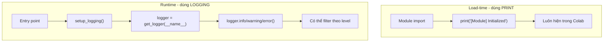

# Hướng dẫn Logging cho CharenjiZukan

Tài liệu này hướng dẫn cách sử dụng logging trong project CharenjiZukan.

---

## 1. Giới thiệu

### 1.1. Logging vs Print

| Đặc điểm        | `print()`         | `logging`                                 |
| --------------- | ----------------- | ----------------------------------------- |
| **Đầu ra**      | Chỉ console       | Console, file, syslog, network...         |
| **Level**       | Không có          | DEBUG < INFO < WARNING < ERROR < CRITICAL |
| **Format**      | Thủ công          | Tự động: timestamp, level, module, line   |
| **Filter**      | Không             | Theo level, module, handler               |
| **Production**  | Không khuyến nghị | Chuẩn production                          |
| **Performance** | Luôn chạy         | Có thể tắt/bật theo level                 |

### 1.2. Khi nào dùng cái nào?

| Loại thông báo              | Nên dùng  | Lý do                          |
| --------------------------- | --------- | ------------------------------ |
| Khởi tạo module (load-time) | `print()` | Luôn hiện, không cần cấu hình  |
| Progress trong Colab        | `print()` | Đơn giản, dễ thấy              |
| Thông tin xử lý             | `logging` | Có thể tắt/bật theo level      |
| Cảnh báo (warning)          | `logging` | Format chuẩn, có thể filter    |
| Lỗi (error)                 | `logging` | Cần timestamp, có thể ghi file |
| Debug chi tiết              | `logging` | Tắt được khi production        |

---

## 2. Module `utils/logger.py`

### 2.1. Các hàm chính

```python
from utils.logger import setup_logging, get_logger, setup_colab_logging
```

| Hàm                                             | Mô tả                                |
| ----------------------------------------------- | ------------------------------------ |
| `setup_logging(level, log_file, format_string)` | Cấu hình logging cho toàn bộ project |
| `get_logger(name)`                              | Lấy logger với tên module            |
| `setup_colab_logging(verbose)`                  | Cấu hình logging cho Google Colab    |

### 2.2. Sử dụng cơ bản

```python
# Trong entry point (translate_srt.py, tts.py)
from utils.logger import setup_logging, get_logger

# Cấu hình logging (gọi 1 lần duy nhất)
setup_logging(level=logging.INFO)

# Lấy logger cho module
logger = get_logger(__name__)

# Sử dụng logger
logger.debug("Chi tiết debug - chỉ hiện khi level=DEBUG")
logger.info("Thông tin chung")
logger.warning("Cảnh báo - có thể có vấn đề")
logger.error("Lỗi - cần xử lý")
```

### 2.3. Sử dụng trong Google Colab

```python
from utils.logger import setup_colab_logging

# Cấu hình logging cho Colab
setup_colab_logging(verbose=True)  # Bật DEBUG level

# Output: [Logger] Logging configured: level=DEBUG
```

---

## 3. Ví dụ cho từng module

### 3.1. Entry point (translate_srt.py, tts.py)

```python
#!/usr/bin/env python3
import argparse
import logging
from pathlib import Path

from utils.logger import setup_logging, get_logger

def main():
    parser = argparse.ArgumentParser()
    parser.add_argument("--verbose", "-v", action="store_true")
    args = parser.parse_args()

    # Cấu hình logging tại entry point
    log_level = logging.DEBUG if args.verbose else logging.INFO
    setup_logging(level=log_level)

    logger = get_logger(__name__)
    logger.info("Starting translation...")

    # ... code xử lý ...

if __name__ == "__main__":
    main()
```

### 3.2. Module library (speed_rate.py)

```python
# -*- coding: utf-8 -*-
"""
speed_rate.py — Audio alignment & concat engine
"""

from utils.logger import get_logger

# Print cho load-time messages (luôn hiện)
print(f"[SpeedRate] rubberband binary: /usr/bin/rubberband")

# Logger cho runtime messages
logger = get_logger(__name__)

def _speedup_audio(wav_path: str, target_ms: int) -> bool:
    logger.debug(f"Processing: {wav_path}")
    # ...
    logger.info(f"Time-stretch completed: {speed_factor:.2f}x")
```

---

## 4. Best Practices

### 4.1. Gọi `setup_logging()` một lần duy nhất

```python
# ✅ ĐÚNG: Gọi tại entry point
def main():
    setup_logging(level=logging.INFO)
    logger = get_logger(__name__)
    # ...

# ❌ SAI: Gọi nhiều lần
def func1():
    setup_logging(level=logging.DEBUG)  # Không nên

def func2():
    setup_logging(level=logging.INFO)   # Không nên
```

### 4.2. Dùng `__name__` cho logger name

```python
# ✅ ĐÚNG: Tự động lấy tên module
logger = get_logger(__name__)

# ❌ SAI: Hardcode tên
logger = get_logger("my_module")
```

### 4.3. Dùng `print()` cho load-time messages

```python
# ✅ ĐÚNG: Print cho load-time
print(f"[SpeedRate] rubberband binary: {rb_path}")

# ❌ SAI: Logging cho load-time (có thể không hiện)
logger.info(f"rubberband binary: {rb_path}")
```

### 4.4. Dùng appropriate level

```python
# ✅ ĐÚNG
logger.debug("Processing file: video.srt")      # Chi tiết
logger.info("Translation completed")            # Thông tin
logger.warning("Audio longer than slot")        # Cảnh báo
logger.error("API request failed: timeout")     # Lỗi

# ❌ SAI
logger.info("Debug value: x=5")                 # Nên dùng debug
logger.error("Processing file...")              # Nên dùng info
```

---

## 5. Sơ đồ luồng



---

## 6. Troubleshooting

### 6.1. Logging không hiện trong Colab

**Nguyên nhân:** Chưa gọi `setup_logging()` hoặc `setup_colab_logging()`.

**Giải pháp:**

```python
from utils.logger import setup_colab_logging
setup_colab_logging(verbose=True)
```

### 6.2. Logging hiện nhiều lần

**Nguyên nhân:** Gọi `setup_logging()` nhiều lần hoặc có nhiều handlers.

**Giải pháp:**

```python
# Reset handlers trước khi cấu hình
import logging
for handler in logging.root.handlers[:]:
    logging.root.removeHandler(handler)

setup_logging(level=logging.INFO)
```

### 6.3. Muốn ghi log ra file

```python
from pathlib import Path
from utils.logger import setup_logging

setup_logging(
    level=logging.INFO,
    log_file=Path("logs/app.log")
)
```

---

## 7. Tham khảo

- [`utils/logger.py`](../utils/logger.py) - Module logging chung
- [`plans/logging-guide.md`](../plans/logging-guide.md) - Plan thiết kế logging
- Python logging documentation: https://docs.python.org/3/library/logging.html
