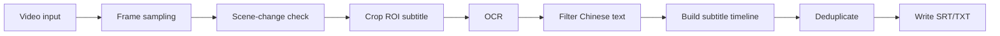

# Video Subtitle Extractor

Trích xuất subtitle tiếng Trung từ video sử dụng DeepSeek-OCR-2.

## Tính năng

- **Frame Sampling**: Lấy mỗi N frame để tối ưu hiệu suất
- **ROI Cropping**: Chỉ OCR vùng subtitle (thường ở dưới video)
- **Scene Detection**: Chỉ xử lý khi có chuyển cảnh
- **Chinese Filter**: Lọc chỉ giữ text tiếng Trung
- **Deduplication**: Loại bỏ text trùng lặp liên tiếp
- **Multiple Output Formats**: SRT hoặc TXT
- **UV-friendly CLI**: Có thể chạy trực tiếp bằng `uv run extract-subtitles`

## Cài đặt

### 1. Cách khuyến nghị: uv + virtual environment

#### Local (Windows/Linux/macOS)

```bash
# Cài uv (nếu chưa có)
pip install uv

# Tạo virtual environment trong project
uv venv .venv

# Cài dependencies từ pyproject.toml
uv sync

# Cài project để dùng CLI entrypoint (extract-subtitles)
uv pip install -e .
```

#### Google Colab (!uv)

```colab
# Cài uv
!curl -LsSf https://astral.sh/uv/install.sh | sh
import os
os.environ["PATH"] += ":/root/.local/bin"

# Clone project và vào thư mục
!git clone <repo-url> /content/CharenjiZukan
%cd /content/CharenjiZukan

# Tạo venv + cài dependencies
!uv venv .venv
!uv sync
!uv pip install -e .
```

### 2. Cài đặt DeepSeek-OCR-2 (khi available)

```bash
# Local Linux/macOS
uv pip install -p .venv/bin/python deepseek-ocr

# Local Windows (cmd/PowerShell)
uv pip install -p .venv\Scripts\python.exe deepseek-ocr

# Hoặc từ GitHub
uv pip install -p .venv/bin/python git+https://github.com/deepseek-ai/DeepSeek-OCR-2.git
```

### 3. Cài đặt PyTorch (cho GPU)

```bash
# CUDA 11.8
uv pip install -p .venv/bin/python torch torchvision --index-url https://download.pytorch.org/whl/cu118

# CUDA 12.1
uv pip install -p .venv/bin/python torch torchvision --index-url https://download.pytorch.org/whl/cu121

# CPU only
uv pip install -p .venv/bin/python torch torchvision
```

> Ghi chú Windows: thay `.venv/bin/python` bằng `.venv\Scripts\python.exe`.

### 4. Cài đặt thủ công (không dùng uv)

```bash
pip install opencv-python pyyaml numpy
```

## Sử dụng

### Cơ bản (khuyến nghị dùng uv)

```bash
# Trích xuất subtitle từ video bằng script entrypoint
uv run extract-subtitles video.mp4

# Output mặc định: video_chinese.srt
```

### Với các tùy chọn

```bash
# Chỉ định file output
uv run extract-subtitles video.mp4 -o subtitles.srt

# Frame sampling mỗi 60 frames (nhanh hơn)
uv run extract-subtitles video.mp4 --frame-interval 60

# Điều chỉnh vùng ROI (subtitle ở dưới hơn)
uv run extract-subtitles video.mp4 --roi-start 0.9

# Sử dụng CPU thay vì GPU
uv run extract-subtitles video.mp4 --device cpu

# Output format TXT
uv run extract-subtitles video.mp4 --format txt
```

### Batch mode

```bash
# Xử lý tất cả video trong thư mục
uv run extract-subtitles --input-dir ./videos --output-dir ./subtitles
```

### Sử dụng config file

```bash
uv run extract-subtitles video.mp4 --config config/extractor_config.yaml
```

### Chạy trực tiếp Python (fallback)

```bash
uv run python main_extract.py video.mp4
```

## Tham số

| Tham số                   | Mô tả                                                      | Mặc định                                                    |
| ------------------------- | ---------------------------------------------------------- | ----------------------------------------------------------- |
| `input_video`             | File video đầu vào (hoặc directory nếu dùng --input-dir)   | (bắt buộc)                                                  |
| `--boxes-file`            | File cấu hình các vùng OCR theo format `name x y w h`      | `assets/boxesOCR.txt` (nếu có config yaml thì config > cli) |
| `--output-dir`            | Thư mục output cho các file theo box                       | cùng thư mục video                                          |
| `--frame-interval`        | Số frame bỏ qua giữa mỗi lần xử lý                         | `30`                                                        |
| `--scene-threshold`       | Ngưỡng phát hiện chuyển cảnh cho từng box                  | `30.0`                                                      |
| `--min-scene-frames`      | Số frame tối thiểu giữa 2 lần chuyển cảnh để tránh nhiễu   | `10`                                                        |
| `--min-chars`             | Số ký tự tối thiểu để ghi nhận                             | `2`                                                         |
| `--no-scene-detection`    | Tắt bỏ tính năng Scene detection (tương đương threshold=0) | (tắt)                                                       |
| `--enable-chinese-filter` | Bật bộ lọc chỉ giữ lại tiếng Trung                         | (tắt)                                                       |
| `--no-punctuation`        | Không giữ dấu câu tiếng Trung (khi bật filter)             | (tắt)                                                       |
| `--ocr-model`             | Tên model trên Hugging Face                                | `deepseek-ai/DeepSeek-OCR-2`                                |
| `--device`                | Thiết bị xử lý (cuda/cpu)                                  | `cuda`                                                      |
| `--hf-token`              | Hugging Face Token                                         | (không dùng)                                                |
| `--batch-size`            | Batch size cho OCR batching                                | `8`                                                         |
| `--format`                | Định dạng output theo box (srt/txt)                        | `srt`                                                       |
| `--default-duration`      | Thời lượng mặc định mỗi subtitle                           | `3.0s`                                                      |
| `--min-duration`          | Thời lượng tối thiểu sau deduplicate                       | `1.0s`                                                      |
| `--max-duration`          | Thời lượng tối đa sau deduplicate                          | `7.0s`                                                      |
| `--no-deduplicate`        | Tắt gộp subtitle trùng lặp                                 | (tắt)                                                       |
| `--warn-english`          | Tạo file cảnh báo riêng nếu subtitle chứa tiếng Anh/số     | (tắt)                                                       |
| `--no-timestamp`          | Tắt timestamp (chỉ với format=txt)                         | (tắt)                                                       |
| `--config`                | Đường dẫn file cấu hình `.yaml`                            | (không dùng)                                                |

> **Mức ưu tiên Cấu hình**: CLI parameters có mức ưu tiên cao nhất, sau đó là tham số khai báo trong `--config`, và cuối cùng là Default values trong code.

## Python API

```python
from video_subtitle_extractor import VideoSubtitleExtractor

# Khởi tạo
extractor = VideoSubtitleExtractor(
    frame_interval=30,        # Mỗi 30 frame
    roi_y_start=0.85,         # Vùng subtitle từ 85% chiều cao
    scene_threshold=30.0,     # Ngưỡng chuyển cảnh
    min_char_count=2,         # Tối thiểu 2 ký tự Trung
    device="cuda"             # Sử dụng GPU
)

# Trích xuất
result = extractor.extract("video.mp4", "output.srt")

print(f"Extracted {result.subtitles_count} subtitles")
print(f"Processing time: {result.processing_time:.2f}s")
```

### Batch processing

```python
from video_subtitle_extractor import VideoSubtitleExtractor

extractor = VideoSubtitleExtractor()

# Xử lý tất cả video trong thư mục
results = extractor.extract_from_directory(
    input_dir="./videos",
    output_dir="./subtitles"
)

for result in results:
    print(f"{result.video_path}: {result.subtitles_count} subtitles")
```

## Cấu trúc module

```
video_subtitle_extractor/
├── __init__.py           # Package exports
├── extractor.py          # Main VideoSubtitleExtractor class
├── frame_processor.py    # Frame sampling, ROI, scene detection
├── chinese_filter.py     # Lọc text tiếng Trung
└── subtitle_writer.py    # Xuất file SRT/TXT
```

## Workflow

```
┌─────────────┐    ┌──────────────────┐    ┌─────────────┐
│   Video     │───►│  Frame Sampling  │───►│  ROI Crop   │
└─────────────┘    └──────────────────┘    └─────────────┘
                                                │
                                                ▼
┌─────────────┐    ┌──────────────────┐    ┌─────────────┐
│   Output    │◄───│  Chinese Filter  │◄───│  DeepSeek   │
│   (SRT)     │    │  (tiếng Trung)   │    │    OCR      │
└─────────────┘    └──────────────────┘    └─────────────┘
```

Flow của module này có thể hiểu theo 2 lớp: luồng thiết kế (khi DeepSeek OCR hoạt động thật) và luồng thực thi hiện tại trong code.



## 1) Luồng chạy từ CLI

- Entry nằm ở [`main()`](main_extract.py:190), parse tham số tại [`parse_args()`](main_extract.py:42).
- Tạo extractor tại [`VideoSubtitleExtractor.__init__()`](video_subtitle_extractor/extractor.py:70) với các tham số frame interval, ROI, scene threshold, device, format output.
- Chạy pipeline chính qua [`VideoSubtitleExtractor.extract()`](video_subtitle_extractor/extractor.py:231).

## 2) Bước xử lý frame (tối ưu trước OCR)

Trong [`FrameProcessor.extract_frames()`](video_subtitle_extractor/frame_processor.py:208), từng frame đi qua [`FrameProcessor.process_frame()`](video_subtitle_extractor/frame_processor.py:154):

- Sampling bằng [`FrameProcessor.should_process_frame()`](video_subtitle_extractor/frame_processor.py:72): chỉ lấy mỗi N frame.
- Scene detection bằng [`FrameProcessor.detect_scene_change()`](video_subtitle_extractor/frame_processor.py:112): so sánh grayscale giữa frame trước và hiện tại, dùng mean diff > threshold.
- Crop vùng subtitle bằng [`FrameProcessor.crop_roi()`](video_subtitle_extractor/frame_processor.py:84): mặc định lấy phần đáy (85%→100% chiều cao).
- Timestamp của subtitle được tính từ frame_number / fps.

## 3) OCR bằng DeepSeek-OCR-2 (về thiết kế)

Trong [`VideoSubtitleExtractor.load_ocr_model()`](video_subtitle_extractor/extractor.py:148), dự kiến load model deepseek rồi gọi OCR từng ROI bằng [`VideoSubtitleExtractor.ocr_image()`](video_subtitle_extractor/extractor.py:186).

Sau OCR:

- Text được lọc bằng [`ChineseFilter.filter_text()`](video_subtitle_extractor/chinese_filter.py:124).
- Nếu text hợp lệ, tạo subtitle entry với end_time là timestamp frame kế tiếp (hoặc default duration cho dòng cuối) trong [`VideoSubtitleExtractor.extract()`](video_subtitle_extractor/extractor.py:231).

## 4) Ghi file output

- Ghi SRT qua [`SubtitleWriter.write_srt()`](video_subtitle_extractor/subtitle_writer.py:208) hoặc TXT qua [`SubtitleWriter.write_txt()`](video_subtitle_extractor/subtitle_writer.py:259).
- Trước khi ghi có deduplicate liên tiếp bằng [`SubtitleWriter.deduplicate()`](video_subtitle_extractor/subtitle_writer.py:119), giúp gộp các dòng OCR trùng nhau theo thời gian.

## 5) Điểm rất quan trọng: trạng thái thực tế hiện tại của repo

Hiện tại code chưa gọi DeepSeek thật:

- Trong [`VideoSubtitleExtractor.load_ocr_model()`](video_subtitle_extractor/extractor.py:148), phần DeepSeek vẫn là TODO và đang fallback sang mock.
- OCR mock trả rỗng ở [`MockOCR.recognize()`](video_subtitle_extractor/extractor.py:441), nên pipeline thường ra 0 subtitle.
- Dependency DeepSeek vẫn đang comment ở [`pyproject.toml`](pyproject.toml:19).

Nghĩa là: **flow xử lý video/frame/filter/write đã có đầy đủ**, nhưng “engine OCR DeepSeek” trong repo hiện tại vẫn là placeholder. Khi thay mock bằng DeepSeek thật, luồng không đổi, chỉ thay khối OCR.

## 6) Tham chiếu tài liệu

Tóm lại, khi dùng DeepSeek-OCR-2 đúng nghĩa thì pipeline là: tối ưu frame → OCR ROI subtitle → lọc tiếng Trung → gộp trùng → xuất SRT/TXT; còn ở trạng thái code hiện tại, phần OCR DeepSeek chưa active nên kết quả thực tế bị rỗng.

## Tối ưu hiệu suất

### 1. Frame Sampling

| frame_interval | Mô tả              | Độ chính xác |
| -------------- | ------------------ | ------------ |
| 30             | Mỗi 1 giây (30fps) | Cao          |
| 60             | Mỗi 2 giây         | Trung bình   |
| 90             | Mỗi 3 giây         | Thấp         |

### 2. ROI Cropping

Vị trí ROI phụ thuộc vào loại video:

| Loại video    | roi_y_start | Ghi chú              |
| ------------- | ----------- | -------------------- |
| Phim điện ảnh | 0.85-0.90   | Subtitle ở dưới cùng |
| TV series     | 0.80-0.85   | Có thể cao hơn       |
| Variety show  | 0.75-0.85   | Thay đổi nhiều       |
| Short video   | 0.70-0.80   | Cần test             |

### 3. Scene Detection

| scene_threshold | Mô tả                 |
| --------------- | --------------------- |
| 10-20           | Nhạy, nhiều frame hơn |
| 30 (mặc định)   | Cân bằng              |
| 40-50           | Ít nhạy, ít frame hơn |

## Yêu cầu phần cứng

| Thành phần | Tối thiểu       | Khuyến nghị      |
| ---------- | --------------- | ---------------- |
| GPU        | NVIDIA 6GB VRAM | NVIDIA 8GB+ VRAM |
| RAM        | 8GB             | 16GB+            |
| Storage    | 5GB             | SSD              |

## Troubleshooting

### Lỗi: "Failed to spawn: extract-subtitles"

```bash
# Cài lại project ở editable mode
uv pip install -e .

# Hoặc chạy trực tiếp file Python
uv run python main_extract.py video.mp4
```

### Lỗi: "CUDA out of memory"

```bash
# Giảm batch size
uv run extract-subtitles video.mp4 --batch-size 4

# Hoặc sử dụng CPU
uv run extract-subtitles video.mp4 --device cpu
```

### Lỗi: "No Chinese subtitles found"

1. Kiểm tra video có subtitle không
2. Điều chỉnh ROI: `--roi-start 0.80`
3. Giảm scene threshold: `--scene-threshold 20`
4. Tăng frame sampling: `--frame-interval 15`

### Lỗi: "Cannot open video"

```bash
# Cài đặt lại OpenCV trong môi trường uv
uv pip install opencv-python --upgrade
```
