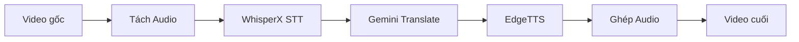
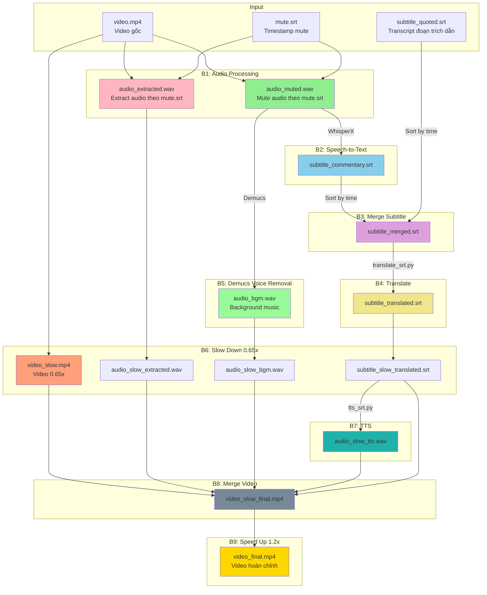
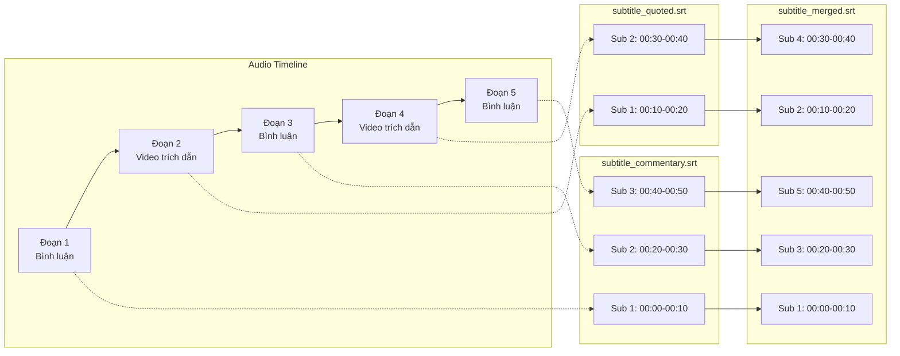

# VideoColab - Workflow Tổng quan

## Bối cảnh

Dự án được phát triển để tự động hóa quy trình lồng tiếng video từ tiếng Trung Quốc sang tiếng Nhật (hoặc các ngôn ngữ khác). Hệ thống tận dụng GPU L4 trên Google Colab để xử lý AI models như WhisperX (Speech-to-Text), Demucs (Source Separation) và EdgeTTS (Text-to-Speech).

## Mục đích

- **Tự động hóa**: Giảm thiểu công việc thủ công trong quy trình lồng tiếng
- **Chi phí thấp**: Sử dụng Google Colab với chi phí GPU thấp
- **Linh hoạt**: Hỗ trợ nhiều ngôn ngữ đích và giọng đọc TTS

## Naming Convention

### File Naming

| Tên file                  | Mô tả                                                  |
| ------------------------- | ------------------------------------------------------ |
| `audio_muted.wav`         | Audio đã mute các đoạn trong mute.srt                  |
| `audio_extracted.wav`     | Audio chỉ chứa các đoạn được extract (ngược với muted) |
| `subtitle_commentary.srt` | Subtitle cho phần bình luận (từ WhisperX)              |
| `subtitle_quoted.srt`     | Subtitle cho phần video trích dẫn (tạo thủ công)       |
| `subtitle_merged.srt`     | Subtitle merge từ commentary + quoted                  |
| `subtitle_translated.srt` | Subtitle đã dịch                                       |
| `audio_bgm.wav`           | Audio background (Demucs remove voice)                 |
| `video_slow.mp4`          | Video slow 0.65x                                       |
| `video_slow_final.mp4`    | Video slow đã ghép audio                               |
| `video_final.mp4`         | Video hoàn chỉnh cuối cùng                             |

## Kiến trúc hệ thống

### Luồng chuẩn (Happy Path)



### Luồng với Audio 2 ngôn ngữ (Full Workflow)



## Các module chính

| Module              | File                   | Chức năng                           | Trạng thái    |
| ------------------- | ---------------------- | ----------------------------------- | ------------- |
| **Mute Audio**      | `cli/mute_srt.py`      | Mute audio từ file mute.srt         | ✅ Hoàn thành |
| **Extract Audio**   | `cli/extract_srt.py`   | Extract audio theo mute.srt         | ✅ Hoàn thành |
| **Merge SRT**       | `cli/merge_srt.py`     | Merge 2 file SRT theo timestamp     | ❌ Cần tạo    |
| **Translate**       | `cli/translate_srt.py` | Dịch file .srt bằng Gemini API      | ✅ Hoàn thành |
| **Demucs**          | `cli/demucs_audio.py`  | Remove voice từ audio               | ❌ Cần tạo    |
| **Slow Down**       | `cli/slow_media.py`    | Slow down video/audio/subtitle      | ❌ Cần tạo    |
| **TTS**             | `cli/tts_srt.py`       | Chuyển .srt thành audio với EdgeTTS | ✅ Hoàn thành |
| **Merge Video**     | `cli/merge_video.py`   | Ghép video + audio + subtitle       | ❌ Cần tạo    |
| **Speed Up**        | `cli/speed_video.py`   | Tăng tốc độ video                   | ❌ Cần tạo    |
| **Speed Rate**      | `speed_rate.py`        | Time-stretch audio để khớp timeline | ✅ Hoàn thành |
| **EdgeTTS Engine**  | `tts_edgetts.py`       | Engine xử lý EdgeTTS                | ✅ Hoàn thành |
| **Translator Core** | `translator.py`        | Logic dịch SRT                      | ✅ Hoàn thành |
| **SRT Parser**      | `utils/srt_parser.py`  | Parse file .srt (dùng chung)        | ✅ Hoàn thành |
| **Audio Utils**     | `utils/audio_utils.py` | Load/export audio, tạo silence      | ✅ Hoàn thành |

## Chi tiết các bước xử lý

### Bước 1: Audio Processing

**Input:** `video.mp4`, `mute.srt`
**Output:** `audio_muted.wav`, `audio_extracted.wav`

#### 1a. Mute Audio (`audio_muted.wav`)

Mute các đoạn được đánh dấu trong `mute.srt` → thay thế bằng silence.

```bash
uv run cli/mute_srt.py --input video.mp4 --mute mute.srt --output audio_muted.wav
```

#### 1b. Extract Audio (`audio_extracted.wav`)

Giữ lại CHỈ các đoạn trong `mute.srt`, các đoạn khác → silence.

```bash
uv run cli/extract_srt.py --input video.mp4 --mute mute.srt --output audio_extracted.wav
```

**Ví dụ file `mute.srt`:**

```srt
1
00:01:24,233 --> 00:01:27,566
[MUTE] Đoạn video gốc được trích dẫn

2
00:05:30,000 --> 00:05:45,500
[MUTE] Đoạn ngôn ngữ thứ hai
```

### Bước 2: Speech-to-Text

**Input:** `audio_muted.wav`
**Output:** `subtitle_commentary.srt`

Sử dụng WhisperX trên Google Colab để chuyển audio thành subtitle.

```python
# Trên Google Colab
import whisperx
model = whisperx.load_model("large-v2", device="cuda", compute_type="float16")
result = model.transcribe("audio_muted.wav")
```

**Lưu ý:** `subtitle_commentary.srt` chỉ chứa subtitle cho phần bình luận (các đoạn KHÔNG bị mute).

### Bước 3: Merge Subtitle

**Input:** `subtitle_commentary.srt`, `subtitle_quoted.srt`
**Output:** `subtitle_merged.srt`

Merge 2 file SRT thành 1 file hoàn chỉnh, sắp xếp theo timestamp.

#### Logic Merge



```bash
uv run cli/merge_srt.py --commentary subtitle_commentary.srt --quoted subtitle_quoted.srt --output subtitle_merged.srt
```

### Bước 4: Translate

**Input:** `subtitle_merged.srt`
**Output:** `subtitle_translated.srt`

Dịch subtitle sang ngôn ngữ đích bằng Gemini API.

```bash
uv run cli/translate_srt.py --input subtitle_merged.srt --lang "Japanese" --keys "AIza..."
```

### Bước 5: Demucs Voice Removal

**Input:** `audio_muted.wav`
**Output:** `audio_bgm.wav`

Sử dụng Demucs để tách voice khỏi background music.

```bash
uv run cli/demucs_audio.py --input audio_muted.wav --output audio_bgm.wav
```

### Bước 6: Slow Down 0.65x

**Input:** `video.mp4`, `audio_extracted.wav`, `audio_bgm.wav`, `subtitle_translated.srt`
**Output:** `video_slow.mp4`, `audio_slow_extracted.wav`, `audio_slow_bgm.wav`, `subtitle_slow_translated.srt`

Tất cả media files đều được làm chậm 0.65x speed.

```bash
# Video
uv run cli/slow_media.py --input video.mp4 --speed 0.65 --output video_slow.mp4

# Audio
uv run cli/slow_media.py --input audio_extracted.wav --speed 0.65 --output audio_slow_extracted.wav
uv run cli/slow_media.py --input audio_bgm.wav --speed 0.65 --output audio_slow_bgm.wav

# Subtitle (adjust timestamps)
uv run cli/slow_media.py --input subtitle_translated.srt --speed 0.65 --output subtitle_slow_translated.srt
```

### Bước 7: TTS

**Input:** `subtitle_slow_translated.srt`
**Output:** `audio_slow_tts.wav`

Tạo audio từ subtitle đã dịch bằng EdgeTTS.

```bash
uv run cli/tts_srt.py --input subtitle_slow_translated.srt --voice ja-JP-KeitaNeural --output audio_slow_tts.wav
```

### Bước 8: Merge Video

**Input:** `video_slow.mp4`, `audio_slow_extracted.wav`, `audio_slow_bgm.wav`, `audio_slow_tts.wav`, `subtitle_slow_translated.srt`
**Output:** `video_slow_final.mp4`

Ghép tất cả thành video hoàn chỉnh.

```bash
uv run cli/merge_video.py \
    --video video_slow.mp4 \
    --audio-extracted audio_slow_extracted.wav \
    --audio-bgm audio_slow_bgm.wav \
    --audio-tts audio_slow_tts.wav \
    --subtitle subtitle_slow_translated.srt \
    --output video_slow_final.mp4
```

### Bước 9: Speed Up 1.2x

**Input:** `video_slow_final.mp4`
**Output:** `video_final.mp4`

Tăng tốc độ video lên 1.2x để video không quá chậm.

```bash
uv run cli/speed_video.py --input video_slow_final.mp4 --speed 1.2 --output video_final.mp4
```

## Tóm tắt trạng thái

| Bước | Module          | Trạng thái                                        |
| ---- | --------------- | ------------------------------------------------- |
| 1a   | Mute audio      | ✅ [`cli/mute_srt.py`](cli/mute_srt.py)           |
| 1b   | Extract audio   | ✅ [`cli/extract_srt.py`](cli/extract_srt.py)     |
| 2    | WhisperX STT    | ✅ Trên Colab                                     |
| 3    | Merge SRT       | ❌ Cần tạo                                        |
| 4    | Translate SRT   | ✅ [`cli/translate_srt.py`](cli/translate_srt.py) |
| 5    | Demucs          | ❌ Cần tạo                                        |
| 6    | Slow down 0.65x | ❌ Cần tạo                                        |
| 7    | TTS             | ✅ [`cli/tts_srt.py`](cli/tts_srt.py)             |
| 8    | Merge video     | ❌ Cần tạo                                        |
| 9    | Speed up 1.2x   | ❌ Cần tạo                                        |

## Điểm kiểm tra (Checkpoints)

- **Sau Bước 2**: Kiểm tra và chỉnh sửa `subtitle_commentary.srt` (lỗi nhận dạng)
- **Sau Bước 3**: Kiểm tra `subtitle_merged.srt` đã merge đúng chưa
- **Sau Bước 4**: Kiểm tra bản dịch, chỉnh thuật ngữ
- **Sau Bước 7**: Kiểm tra chất lượng audio TTS
- **Sau Bước 8**: Kiểm tra video slow trước khi speed up

## Xử lý sự cố

- **Audio có 2 ngôn ngữ**: Tạo `mute.srt` và dùng `cli/mute_srt.py`
- **Audio dài hơn slot SRT**: Bật `--autorate` để tự động nén
- **Lỗi kết nối EdgeTTS**: Sử dụng `--proxy`
- **Output không có extension**: Tự động thêm `.wav`

## Tài liệu liên quan

- [Hướng dẫn sử dụng trên Google Colab](colab-guide.md) - Cài đặt, cấu hình Secrets và quy trình hoàn chỉnh

## Changelog

- **2026-03-13**: Cập nhật workflow đầy đủ 9 bước với naming convention mới
- **2026-03-11**: Thêm hỗ trợ uv cho Google Colab
- **2026-03-11**: Fix lỗi output không có extension trong tts_srt.py
- **2026-03-11**: Thêm tự động thêm `.wav` nếu output không có extension
