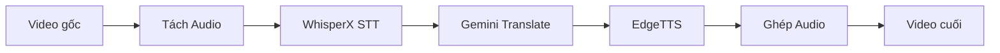

# VideoColab - Workflow Tổng quan

## Bối cảnh

Dự án được phát triển để tự động hóa quy trình lồng tiếng video từ tiếng Trung Quốc sang tiếng Nhật (hoặc các ngôn ngữ khác). Hệ thống tận dụng GPU L4 trên Google Colab để xử lý AI models như WhisperX (Speech-to-Text) và EdgeTTS (Text-to-Speech).

## Mục đích

- **Tự động hóa**: Giảm thiểu công việc thủ công trong quy trình lồng tiếng
- **Chi phí thấp**: Sử dụng Google Colab với chi phí GPU thấp
- **Linh hoạt**: Hỗ trợ nhiều ngôn ngữ đích và giọng đọc TTS

## Kiến trúc hệ thống

## Các module chính

| Module              | File               | Chức năng                           |
| ------------------- | ------------------ | ----------------------------------- |
| **Translate**       | `translate_srt.py` | Dịch file .srt bằng Gemini API      |
| **TTS**             | `tts_srt.py`       | Chuyển .srt thành audio với EdgeTTS |
| **Speed Rate**      | `speed_rate.py`    | Time-stretch audio để khớp timeline |
| **EdgeTTS Engine**  | `tts_edgetts.py`   | Engine xử lý EdgeTTS                |
| **Translator Core** | `translator.py`    | Logic dịch SRT                      |

## Luồng xử lý chính

### 1. Luồng lý tưởng (Happy Path)

1. **Tải video** - Đồng bộ từ Google Drive
2. **Speech-to-Text** - WhisperX chuyển audio thành .srt
3. **Dịch** - Gemini API dịch .srt sang ngôn ngữ đích
4. **Text-to-Speech** - EdgeTTS tạo audio từ .srt đã dịch
5. **Ghép audio** - FFmpeg ghép audio vào video

### 2. Điểm kiểm tra (Checkpoints)

- **Sau Bước 2**: Kiểm tra và chỉnh sửa file .srt (lỗi nhận dạng)
- **Sau Bước 3**: Kiểm tra bản dịch, chỉnh thuật ngữ
- **Sau Bước 4**: Kiểm tra chất lượng audio

### 3. Xử lý sự cố

- **Audio dài hơn slot SRT**: Bật `--autorate` để tự động nén
- **Lỗi kết nối EdgeTTS**: Sử dụng `--proxy`
- **Output không có extension**: Tự động thêm `.wav`

## Tài liệu liên quan

- [Hướng dẫn sử dụng trên Google Colab](colab-guide.md) - Cài đặt, cấu hình Secrets và quy trình hoàn chỉnh

## Changelog

- **2026-03-11**: Thêm hỗ trợ uv cho Google Colab
- **2026-03-11**: Fix lỗi output không có extension trong tts_srt.py
- **2026-03-11**: Thêm tự động thêm `.wav` nếu output không có extension
