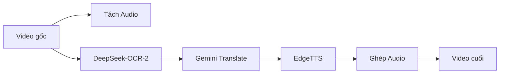
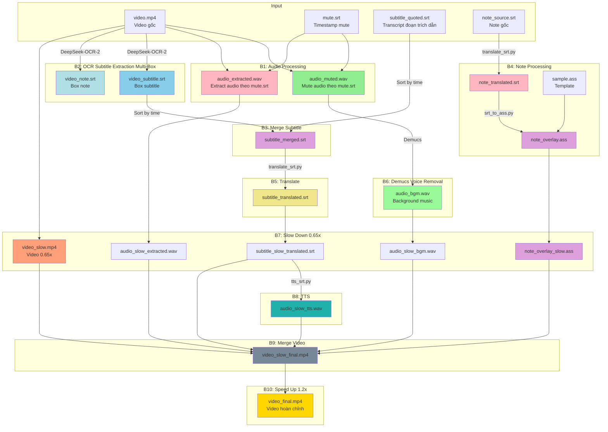
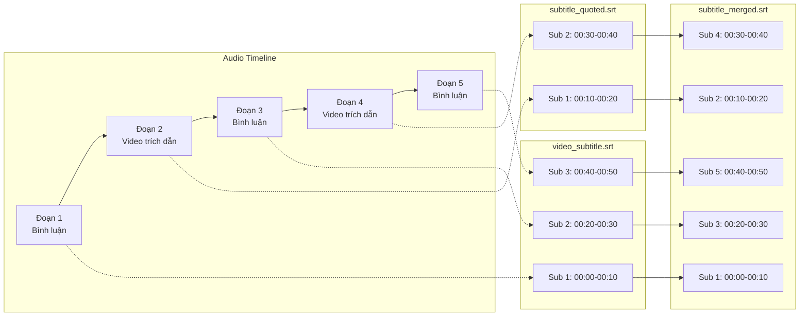

# VideoColab - Workflow Tổng quan

## Bối cảnh

Dự án được phát triển để tự động hóa quy trình lồng tiếng video từ tiếng Trung Quốc sang tiếng Nhật (hoặc các ngôn ngữ khác). Hệ thống tận dụng GPU L4 trên Google Colab để xử lý AI models như WhisperX (Speech-to-Text), Demucs (Source Separation) và EdgeTTS (Text-to-Speech).

## Mục đích

- **Tự động hóa**: Giảm thiểu công việc thủ công trong quy trình lồng tiếng
- **Chi phí thấp**: Sử dụng Google Colab với chi phí GPU thấp
- **Linh hoạt**: Hỗ trợ nhiều ngôn ngữ đích và giọng đọc TTS

## Naming Convention

### File Naming

| Tên file                    | Mô tả                                                  |
| --------------------------- | ------------------------------------------------------ |
| `audio_muted.wav`           | Audio đã mute các đoạn trong mute.srt                  |
| `audio_extracted.wav`       | Audio chỉ chứa các đoạn được extract (ngược với muted) |
| `<video_stem>_subtitle.srt` | Subtitle box chính từ Multi-Box OCR                    |
| `<video_stem>_note.srt`     | Subtitle box note từ Multi-Box OCR                     |
| `subtitle_quoted.srt`       | Subtitle cho phần video trích dẫn (tạo thủ công)       |
| `subtitle_merged.srt`       | Subtitle merge từ subtitle box chính + quoted          |
| `subtitle_translated.srt`   | Subtitle đã dịch                                       |
| `note_source.srt`           | File note gốc (chưa dịch)                              |
| `note_translated.srt`       | File note đã dịch                                      |
| `note_overlay.ass`          | File ASS để overlay note lên video                     |
| `audio_bgm.wav`             | Audio background (Demucs remove voice)                 |
| `video_slow.mp4`            | Video slow 0.65x                                       |
| `note_overlay_slow.ass`     | File ASS đã slow down 0.65x                            |
| `video_slow_final.mp4`      | Video slow đã ghép audio                               |
| `video_final.mp4`           | Video hoàn chỉnh cuối cùng                             |

## Kiến trúc hệ thống

### Luồng chuẩn (Happy Path)



### Luồng với Audio 2 ngôn ngữ (Full Workflow)



## Các module chính

| Module              | File                   | Chức năng                                        | Trạng thái    |
| ------------------- | ---------------------- | ------------------------------------------------ | ------------- |
| **Mute Audio**      | `cli/mute_srt.py`      | Mute audio từ file mute.srt                      | ✅ Hoàn thành |
| **Extract Audio**   | `cli/extract_srt.py`   | Extract audio theo mute.srt                      | ✅ Hoàn thành |
| **Extract Sub**     | `cli/video_ocr.py`      | Trích xuất subtitle Multi-Box bằng OCR           | ✅ Hoàn thành |
| **Merge SRT**       | `cli/merge_srt.py`     | Merge 2 file SRT theo timestamp                  | ✅ Hoàn thành |
| **Translate**       | `cli/translate_srt.py` | Dịch file .srt bằng Gemini API                   | ✅ Hoàn thành |
| **SRT to ASS**      | `cli/srt_to_ass.py`    | Chuyển SRT → ASS với template                    | ✅ Hoàn thành |
| **Demucs**          | `cli/demucs_audio.py`  | Remove voice từ audio                            | ✅ Hoàn thành |
| **Media Speed**     | `cli/media_speed.py`   | Thay đổi tốc độ video/audio/subtitle (slow/fast) | ✅ Hoàn thành |
| **TTS**             | `cli/tts_srt.py`       | Chuyển .srt thành audio với EdgeTTS              | ✅ Hoàn thành |
| **Merge Video**     | `cli/merge_video.py`   | Ghép video + audio + subtitle + ass              | ❌ Cần tạo    |
| **Speed Up**        | `cli/speed_video.py`   | Tăng tốc độ video                                | ❌ Cần tạo    |
| **Speed Rate**      | `speed_rate.py`        | Time-stretch audio để khớp timeline              | ✅ Hoàn thành |
| **EdgeTTS Engine**  | `tts_edgetts.py`       | Engine xử lý EdgeTTS                             | ✅ Hoàn thành |
| **Translator Core** | `translator.py`        | Logic dịch SRT                                   | ✅ Hoàn thành |
| **SRT Parser**      | `utils/srt_parser.py`  | Parse file .srt (dùng chung)                     | ✅ Hoàn thành |
| **Audio Utils**     | `utils/audio_utils.py` | Load/export audio, tạo silence                   | ✅ Hoàn thành |
| **ASS Utils**       | `utils/ass_utils.py`   | Xử lý ASS format                                 | ✅ Hoàn thành |
| **Media Utils**     | `utils/media_utils.py` | Xử lý media speed (stretch, scale timestamp)     | ✅ Hoàn thành |

## Chi tiết các bước xử lý

### Bước 1: Audio Processing

**Input:** `video.mp4`, `mute.srt`
**Output:** `audio_muted.wav`, `audio_extracted.wav`

#### 1a. Mute Audio (`audio_muted.wav`)

Mute các đoạn được đánh dấu trong `mute.srt` → thay thế bằng silence.

```bash
uv run cli/mute_srt.py --input video.mp4 --mute mute.srt --output audio_muted.wav
```

#### 1b. Extract Audio (`audio_extracted.wav`)

Giữ lại CHỈ các đoạn trong `mute.srt`, các đoạn khác → silence.

```bash
uv run cli/extract_srt.py --input video.mp4 --mute mute.srt --output audio_extracted.wav
```

**Ví dụ file `mute.srt`:**

```srt
1
00:01:24,233 --> 00:01:27,566
[MUTE] Đoạn video gốc được trích dẫn

2
00:05:30,000 --> 00:05:45,500
[MUTE] Đoạn ngôn ngữ thứ hai
```

### Bước 2: OCR Subtitle Extraction Multi-Box

**Input:** `video.mp4`, `assets/boxesOCR.txt`
**Output:** `<video_stem>_subtitle.srt`, `<video_stem>_note.srt` và các file theo từng box

Sử dụng `video_subtitle_extractor` (DeepSeek-OCR-2) để trích xuất subtitle trực tiếp từ video theo nhiều vùng box.

```bash
uv run extract-subtitles video.mp4 \
  --boxes-file assets/boxesOCR.txt \
  --output-dir . \
  --frame-interval 30 \
  --scene-threshold 30.0 \
  --device cuda \
  --hf-token "{hf_token}" \
  --enable-chinese-filter
```

**Format file box OCR:** mỗi dòng có cấu trúc `name x y w h`

```text
subtitle 370 930 1180 140
```

**Lưu ý:**

- Tên file output theo mẫu `<video_stem>_<box_name>.srt` hoặc `.txt`
- OCR chỉ chạy cho các box có thay đổi hình ảnh để tối ưu hiệu năng
- Nếu muốn đưa vào bước merge, dùng file box chính như `<video_stem>_subtitle.srt`

### Bước 3: Merge Subtitle

**Input:** `<video_stem>_subtitle.srt`, `subtitle_quoted.srt`
**Output:** `subtitle_merged.srt`

Merge 2 file SRT thành 1 file hoàn chỉnh, sắp xếp theo timestamp.

#### Logic Merge



```bash
uv run cli/merge_srt.py --commentary video_subtitle.srt --quoted subtitle_quoted.srt --output subtitle_merged.srt
```

### Bước 4: Note Processing

**Input:** `note_source.srt`, `assets/sample.ass`
**Output:** `note_translated.srt`, `note_overlay.ass`

Xử lý file note để tạo overlay hiển thị trên video.

#### 4a. Translate Note

Dịch file note sang ngôn ngữ đích bằng Gemini API.

```bash
uv run cli/translate_srt.py --input note_source.srt --lang "Japanese" --keys "AIza..." --output note_translated.srt
```

#### 4b. Convert SRT to ASS

Chuyển file SRT đã dịch thành file ASS để overlay lên video.

```bash
uv run cli/srt_to_ass.py --input note_translated.srt --template assets/sample.ass --output note_overlay.ass
```

**Lưu ý:**

- File ASS sử dụng template từ `assets/sample.ass`
- Text tự động ngắt dòng nếu quá 14 ký tự Nhật
- Các xuống dòng trong SRT được giữ nguyên với `\N` trong ASS

### Bước 5: Translate

**Input:** `subtitle_merged.srt`
**Output:** `subtitle_translated.srt`

Dịch subtitle sang ngôn ngữ đích bằng Gemini API.

```bash
uv run cli/translate_srt.py --input subtitle_merged.srt --lang "Japanese" --keys "AIza..."
```

### Bước 6: Demucs Voice Removal

**Input:** `audio_muted.wav`
**Output:** `audio_bgm.wav` hoặc `audio_vocals.wav`

Sử dụng Demucs để tách voice khỏi background music.

#### Source Indices

Demucs tách audio thành 4 sources:

| Index | Source | Mô tả     |
| ----- | ------ | --------- |
| 0     | drums  | Trống     |
| 1     | bass   | Bass      |
| 2     | other  | Nhạc khác |
| 3     | vocals | Giọng hát |

#### Options

| Tham số           | Mô tả                                               | Mặc định          |
| ----------------- | --------------------------------------------------- | ----------------- |
| `--input`, `-i`   | File audio đầu vào                                  | (bắt buộc)        |
| `--output`, `-o`  | File audio đầu ra (.wav, .mp3, .m4a, .aac)          | `<input>_bgm.wav` |
| `--model`, `-m`   | Model Demucs: htdemucs, htdemucs_ft, mdx, mdx_extra | `htdemucs`        |
| `--keep`, `-k`    | Sources giữ lại (xem bảng dưới)                     | `bgm`             |
| `--bitrate`, `-b` | Bitrate cho MP3/M4A output                          | `192k`            |
| `--device`, `-d`  | Device: cuda, cuda:0, cpu                           | auto-detect       |
| `--verbose`, `-v` | Hiển thị log chi tiết                               | (tắt)             |

#### Ví dụ

```bash
# Mặc định: BGM (drums + bass + other)
uv run demucs-audio --input audio_muted.wav

# Output MP3 với bitrate nhỏ
uv run demucs-audio --input audio_muted.wav --output bgm.mp3 --bitrate 128k

# Chỉ lấy vocals
uv run demucs-audio --input audio_muted.wav --keep vocals

# Chỉ lấy source "other" (index 2)
uv run demucs-audio --input audio_muted.wav --keep 2 --output other.mp3

# Lấy drums + bass (index 0,1)
uv run demucs-audio --input audio_muted.wav --keep 0,1 --output drums_bass.m4a

# Với model chất lượng cao
uv run demucs-audio --input audio_muted.wav --model htdemucs_ft
```

### Bước 7: Slow Down 0.65x

**Input:** `video.mp4`, `audio_extracted.wav`, `audio_bgm.wav`, `subtitle_translated.srt`, `note_overlay.ass`
**Output:** `video_slow.mp4`, `audio_slow_extracted.wav`, `audio_slow_bgm.wav`, `subtitle_slow_translated.srt`, `note_overlay_slow.ass`

Tất cả media files đều được làm chậm 0.65x speed. Module `cli/media_speed.py` hỗ trợ cả slow down (`speed < 1.0`) và speed up (`speed > 1.0`).

#### Tính năng

- **Video**: Làm chậm video + audio (sử dụng FFmpeg setpts + rubberband)
- **Audio**: Time-stretch giữ nguyên pitch (ưu tiên rubberband, fallback FFmpeg atempo)
- **SRT**: Scale timestamps, giữ nguyên text
- **ASS**: Scale timestamps trong Dialogue lines, giữ nguyên style

#### Ví dụ sử dụng

```bash
# Video (mặc định giữ audio)
uv run cli/media_speed.py --input video.mp4 --speed 0.65 --output video_slow.mp4

# Audio
uv run cli/media_speed.py --input audio_extracted.wav --speed 0.65 --output audio_slow_extracted.wav
uv run cli/media_speed.py --input audio_bgm.wav --speed 0.65 --output audio_slow_bgm.wav

# Subtitle (adjust timestamps)
uv run cli/media_speed.py --input subtitle_translated.srt --speed 0.65 --output subtitle_slow_translated.srt

# ASS Note (adjust timestamps)
uv run cli/media_speed.py --input note_overlay.ass --speed 0.65 --output note_overlay_slow.ass

# Output naming tự động
uv run cli/media_speed.py --input video.mp4 --speed 0.65  # → video_slow.mp4
uv run cli/media_speed.py --input video.mp4 --speed 1.5  # → video_fast.mp4
```

### Bước 8: TTS

**Input:** `subtitle_slow_translated.srt`
**Output:** `audio_slow_tts.wav`

Tạo audio từ subtitle đã dịch bằng EdgeTTS.

```bash
uv run cli/tts_srt.py --input subtitle_slow_translated.srt --voice ja-JP-KeitaNeural --output audio_slow_tts.wav
```

### Bước 9: Merge Video

**Input:** `video_slow.mp4`, `audio_slow_extracted.wav`, `audio_slow_bgm.wav`, `audio_slow_tts.wav`, `subtitle_slow_translated.srt`, `note_overlay_slow.ass`
**Output:** `video_slow_final.mp4`

Ghép tất cả thành video hoàn chỉnh.

```bash
uv run cli/merge_video.py \
    --video video_slow.mp4 \
    --audio-extracted audio_slow_extracted.wav \
    --audio-bgm audio_slow_bgm.wav \
    --audio-tts audio_slow_tts.wav \
    --subtitle subtitle_slow_translated.srt \
    --note-ass note_overlay_slow.ass \
    --output video_slow_final.mp4
```

### Bước 10: Speed Up 1.2x

**Input:** `video_slow_final.mp4`
**Output:** `video_final.mp4`

Tăng tốc độ video lên 1.2x để video không quá chậm.

```bash
uv run cli/speed_video.py --input video_slow_final.mp4 --speed 1.2 --output video_final.mp4
```

## Tóm tắt trạng thái

| Bước | Module         | Trạng thái                                        |
| ---- | -------------- | ------------------------------------------------- |
| 1a   | Mute audio     | ✅ [`cli/mute_srt.py`](cli/mute_srt.py)           |
| 1b   | Extract audio  | ✅ [`cli/extract_srt.py`](cli/extract_srt.py)     |
| 2    | Extract Sub    | ✅ [`cli/video_ocr.py`](cli/video_ocr.py)           |
| 3    | Merge SRT      | ✅ [`cli/merge_srt.py`](cli/merge_srt.py)         |
| 4a   | Translate Note | ✅ [`cli/translate_srt.py`](cli/translate_srt.py) |
| 4b   | SRT to ASS     | ✅ [`cli/srt_to_ass.py`](cli/srt_to_ass.py)       |
| 5    | Translate SRT  | ✅ [`cli/translate_srt.py`](cli/translate_srt.py) |
| 6    | Demucs         | ✅ [`cli/demucs_audio.py`](cli/demucs_audio.py)   |
| 7    | Media Speed    | ✅ [`cli/media_speed.py`](cli/media_speed.py)     |
| 8    | TTS            | ✅ [`cli/tts_srt.py`](cli/tts_srt.py)             |
| 9    | Merge video    | ❌ Cần tạo                                        |
| 10   | Speed up 1.2x  | ❌ Cần tạo                                        |

## Điểm kiểm tra (Checkpoints)

- **Sau Bước 2**: Kiểm tra và chỉnh sửa các file OCR theo box, đặc biệt `video_subtitle.srt` và `video_note.srt`
- **Sau Bước 3**: Kiểm tra `subtitle_merged.srt` đã merge đúng chưa
- **Sau Bước 4**: Kiểm tra bản dịch, chỉnh thuật ngữ
- **Sau Bước 7**: Kiểm tra chất lượng audio TTS
- **Sau Bước 8**: Kiểm tra video slow trước khi speed up

## Xử lý sự cố

- **Audio có 2 ngôn ngữ**: Tạo `mute.srt` và dùng `cli/mute_srt.py`
- **Audio dài hơn slot SRT**: Bật `--autorate` để tự động nén
- **Lỗi kết nối EdgeTTS**: Sử dụng `--proxy`
- **Output không có extension**: Tự động thêm `.wav`

## Tài liệu liên quan

- [Hướng dẫn sử dụng trên Google Colab](colab-guide.md) - Cài đặt, cấu hình Secrets và quy trình hoàn chỉnh

## Changelog

- **2026-03-18**: Cập nhật bước OCR sang Multi-Box với `boxesOCR.txt`, Selective OCR và output theo từng box
- **2026-03-13**: Cập nhật workflow đầy đủ 9 bước với naming convention mới
- **2026-03-11**: Thêm hỗ trợ uv cho Google Colab
- **2026-03-11**: Fix lỗi output không có extension trong tts_srt.py
- **2026-03-11**: Thêm tự động thêm `.wav` nếu output không có extension
